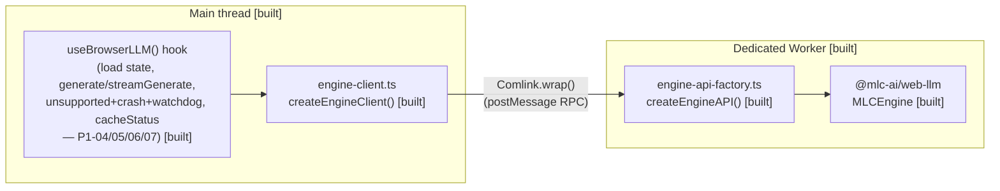

# Architecture diagrams

Living diagrams of the system's components and how they connect. Each component is diagrammed as it is built, so the system stays fully documented as it grows — never reconstructed from memory at the end.

Use **Mermaid** for every diagram so it renders inline on GitHub.

## Component status

Mark each component with its current state so a reader can tell what exists from what is planned:

- **built** — merged and running
- **in-PR** — implemented in an open PR, not yet merged
- **planned** — agreed but not yet started

A simple convention is a status label on or beside each node (e.g. `Worker [built]`), or a legend that maps node styling to status. Pick one and stay consistent.

## Example

---

<!-- Add and update component diagrams below as the system grows -->

## use-browser-llm: Worker + Comlink RPC boundary

Introduced in P1-03. The only place the raw `@mlc-ai/web-llm` engine is
touched is inside the Worker; the main thread only ever talks to it through
a Comlink-typed proxy. `EngineAPI` (`src/engine-api.ts`) is the shared
contract both sides compile against without cross-importing each other's
lib-specific globals (DOM vs WebWorker).

Notes:

- `EngineAPI` is exposed via `Comlink.expose()` in `worker.ts`, never web-llm's own `WebWorkerMLCEngine`/`Handler` — see `.claude/epics/use-local-llm/epic.md`'s Scope Deltas for why both would have been redundant.
- Callback arguments (`onProgress`, `onToken`) cross the boundary via `Comlink.proxy()`, not plain function references — Comlink does not auto-proxy functions. **P2-02 (built)** adds a dedicated real-browser test (`test/integration/comlink-proxy.browser.test.ts` + `test/integration/fixtures/echo-worker.ts`) proving this mechanism itself works over a genuine `postMessage` boundary — the existing `worker-boundary.browser.test.ts` only exercised a plain scalar round-trip (`checkCache()`), never a proxied callback. Building it surfaced that a Comlink-proxied callback invoked repeatedly with no yield between calls silently drops all but the last invocation; production's `streamGenerate` is unaffected (its `for await` loop naturally yields between `onToken` calls), but `loadModel`'s `onProgress` delivery under `MLCEngine`'s own internal call cadence is unverified — see `SPLIT-PLAN §6 (backlog)`.
- `useBrowserLLM()` now covers model-loading state (idle/loading/ready/error/unsupported), generate/streamGenerate/abort, WebGPU capability detection (short-circuits to `unsupported` before ever creating a worker), worker-crash/inactivity-watchdog error handling, and cache-status exposure (`cacheStatus`, via `EngineAPI.checkCache()` → web-llm's own `hasModelInCache()`, only ever called from inside the worker to keep web-llm's runtime out of the main bundle). Remaining Phase 1 work (tests, docs, publish polish) doesn't add hook behavior, just hardens/documents what's here.
- Crash/watchdog detection now spans the full hook lifecycle, not just loading. P1-07 covered the loading phase (`onCrash` + a reset-on-progress inactivity watchdog). **P2-01 (built)** extends the same `EngineClient.onCrash()` mechanism to `generate()` (races the call against `onCrash` and a flat `GENERATE_TIMEOUT_MS` timeout) and `streamGenerate()` (races against `onCrash` and a reset-on-token inactivity watchdog, both wired through an `AbortSignal` extension to `src/to-async-generator.ts` so a suspended `for await` can be unstuck from outside once the underlying worker is confirmed dead).
- **Phase 1 complete (P1-10):** the public API is now polish-frozen — `generate()`/`streamGenerate()` take a self-contained `ChatMessage` type (`src/types.ts`), not a re-export of web-llm's own message type, so `dist/index.d.ts` has zero imports from `@mlc-ai/web-llm` or `comlink`. `npm pack` ships exactly `dist/`, `README.md`, `LICENSE`, `package.json` (no sourcemaps — they embedded full original source, contradicting "no source shipped"). CI now asserts the worker chunk never leaks into `dist/index.js` on every PR (`grep MLCEngine`), on top of the manual real-Vite-consumer-project verification done for this task. `.github/workflows/publish.yml` is gated on a `v*` tag push only.
- **Post-close rename:** the npm name `use-local-llm` turned out to already be taken by an unrelated package (a different, server-based local-LLM hook). Renamed the package, the exported hook (`useLocalLLM` → `useBrowserLLM`), the GitHub repo, and this diagram's naming to `use-browser-llm` before the first real publish. The `.claude/epics/use-local-llm/` CCPM directory name and PRD/epic frontmatter `name:` field were deliberately left as `use-local-llm` — that's the internal Phase 1 planning identifier, decoupled from the published package name, and renaming closed historical docs would be revisionist for no functional benefit.
