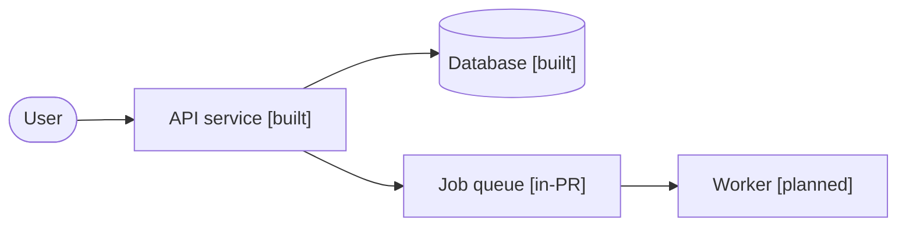

# Architecture diagrams

Living diagrams of the system's components and how they connect. Each component is diagrammed as it is built, so the system stays fully documented as it grows — never reconstructed from memory at the end.

Use **Mermaid** for every diagram so it renders inline on GitHub.

## Component status

Mark each component with its current state so a reader can tell what exists from what is planned:

- **built** — merged and running
- **in-PR** — implemented in an open PR, not yet merged
- **planned** — agreed but not yet started

A simple convention is a status label on or beside each node (e.g. `Worker [built]`), or a legend that maps node styling to status. Pick one and stay consistent.

## Example

---

<!-- Add and update component diagrams below as the system grows -->
