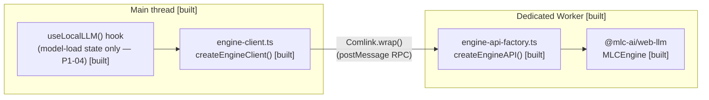

# Architecture diagrams

Living diagrams of the system's components and how they connect. Each component is diagrammed as it is built, so the system stays fully documented as it grows — never reconstructed from memory at the end.

Use **Mermaid** for every diagram so it renders inline on GitHub.

## Component status

Mark each component with its current state so a reader can tell what exists from what is planned:

- **built** — merged and running
- **in-PR** — implemented in an open PR, not yet merged
- **planned** — agreed but not yet started

A simple convention is a status label on or beside each node (e.g. `Worker [built]`), or a legend that maps node styling to status. Pick one and stay consistent.

## Example

---

<!-- Add and update component diagrams below as the system grows -->

## use-local-llm: Worker + Comlink RPC boundary

Introduced in P1-03. The only place the raw `@mlc-ai/web-llm` engine is
touched is inside the Worker; the main thread only ever talks to it through
a Comlink-typed proxy. `EngineAPI` (`src/engine-api.ts`) is the shared
contract both sides compile against without cross-importing each other's
lib-specific globals (DOM vs WebWorker).

Notes:

- `EngineAPI` is exposed via `Comlink.expose()` in `worker.ts`, never web-llm's own `WebWorkerMLCEngine`/`Handler` — see `.claude/epics/use-local-llm/epic.md`'s Scope Deltas for why both would have been redundant.
- Callback arguments (`onProgress`, `onToken`) cross the boundary via `Comlink.proxy()`, not plain function references — Comlink does not auto-proxy functions.
- `useLocalLLM()` currently covers only model-loading state (idle/loading/ready/error). P1-05 (generate/streamGenerate), P1-06 (cache-status), and P1-07 (unsupported-browser path) extend the same hook — this diagram's `hook` node will grow annotations as each merges, rather than gaining new nodes.
